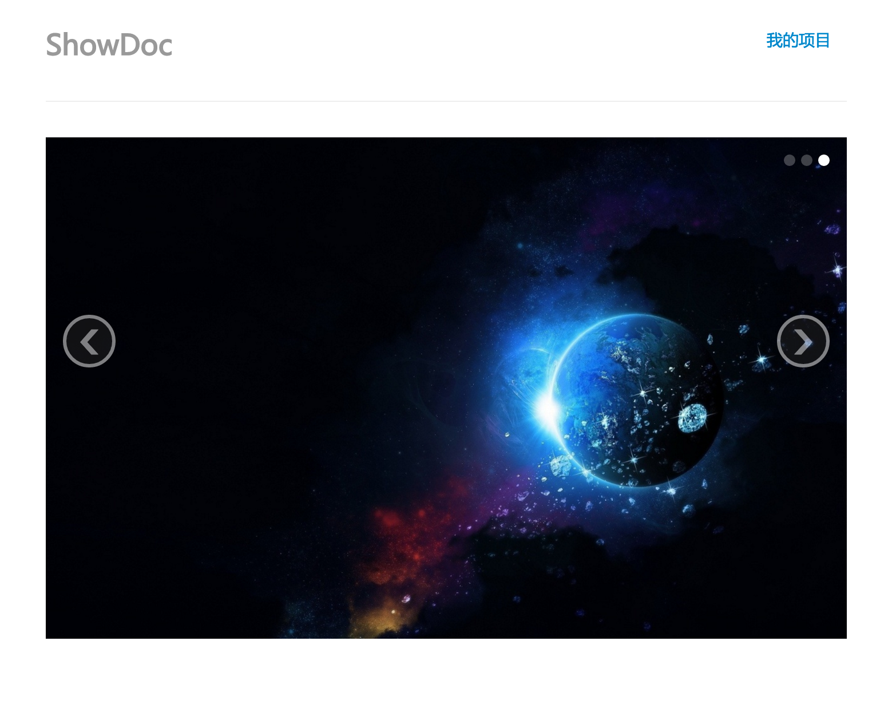

# lua-showdoc

一个运行在[OpenResty](http://openresty.org)上的基于[Vanilla](https://github.com/idevz/vanilla) 0.1.0.rc6编写的api接口文档管理程序。

- 主要页面直接采用了[showdoc](https://github.com/star7th/showdoc)的样式
- 完全基于OpenResty，是入门OpenResty Web开发的良好范例
- 基于[Vanilla](https://github.com/idevz/vanilla) 0.1.0.rc6，轻松简单的完成web应用开发
- 存储采用MySQL，文件本地落地存储

### 安装

- 首先安装OpenResty、luajit和[Vanilla](https://github.com/idevz/vanilla)框架，安装成功的标志是以下三个命令可以正常输出
	- nginx -v
	- luajit -v
- 将仓库中提供的[sql文件](install/api.sql)导入到MySQL
- 修改配置文件`config/application.lua`为本地对应配置
- 执行`sh va-van16-service confinit` 初始化nginx配置文件
- 执行`sh va-van16-service start` 即可使用nginx_conf/va-nginx.conf启动生产环境，也可使用`sh va-van16-service start dev`即可使用nginx_conf/va-nginx.即可使用nginx_conf/vhost/van16.conf为本地合适的配置
- 生产环境访问`http://localhost`即可体验lua-showdoc功能，开发环境默认端口9110
- 有几个初始账户供体验: showdoc，密码为123456

## 更多信息

- 参见Vanilla [文档](https://idevz.gitbooks.io/vanilla-zh/content/index.html)

## License

MIT

### 社区组织(主要是Vanilla)
#### *QQ群&&微信公众号*
- *Openresty/Vanilla开发QQ群：205773855（专题讨论Vanilla相关话题）*
- *Openresty 技术交流QQ群：34782325（讨论OpenResty和各种高级技术）*
- *Vanilla开发微信公众号:Vanilla-OpenResty(Vanilla相关资讯、文档推送)*

